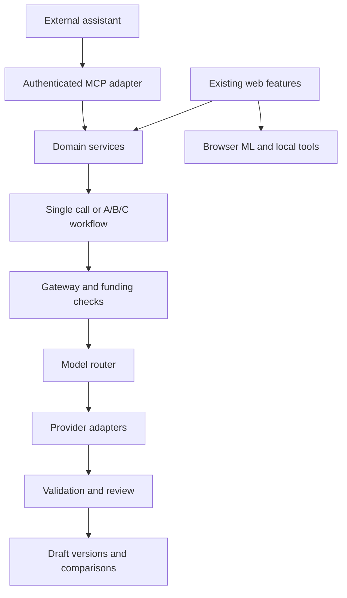

# TrackMyself AI Work Plan — Confirmed Findings and Funding Policy

Updated 24 September 2026. This revision incorporates the user's source-verified banner vulnerability, actual Application fields, and metered free-user funding choice. It supersedes the earlier plan. It is a work proposal, not a deployed change or an independent source-code audit. Allowance numbers below are proposed starting defaults.

## 1. Decisions and constraints

The latest user-supplied inventory, reported as verified from source, is the baseline for this revision. Repeated rows 1–3 in the pasted table are duplicates: there are four server-side LLM surfaces and one browser-side ML feature.

Preserve the existing tailored CV, cover letter, resume, interview questions, comparison view, and document exports. Improve the shared AI infrastructure and add useful analysis; do not rebuild already-working features.

Confirmed constraints: fewer than 1,000 monthly AI generations initially; operator model API budget below USD 10, with free alternatives preferred. “Generation” still needs definition: one user action, one artifact, one pack, and one API call are different units. Examples below distinguish these. Hosting, database, taxes and card fees are excluded from the API budget unless the owner says otherwise.

Core decisions:

- Extend `lib/cv/ai/provider.ts` and its existing `callProvider()` / `resolveCredentials()` contracts. Add an internal gateway and rule-based model router; a separate gateway service is unnecessary initially.
- Apply shared budget and usage controls to all four server LLM features and new server AI features. Existing `User.aiUsage` token totals are useful but do not establish an atomic shared monetary spending limit.
- Preserve MODNet as browser-only ML, outside the server gateway and API spending ledger.
- Release a P0 hotfix first: block anonymous shared-model spending on the unthrottled banner endpoint.
- First release: infrastructure controls, preview-result reuse, and JD-to-CV gap analysis.
- Proposed free allowance: 10 operator-funded provider attempts per account per calendar month, across eligible features. Editor/admin accounts whose effective plan is free follow the same allowance. Premium and superadmin do not bypass the global USD 9 ceiling.
- Moderate release: bounded A/B/C document workflow, read-only application triage, and better rule-based duplicate and stale-listing suggestions.
- Final phase: authenticated MCP tools calling the same services.
- Skip n8n unless external integrations become substantial.
- Premium models such as Sol, Opus and Astra remain mainly BYOK under this budget. A cheap hosted model is a candidate to evaluate, not an assumed quality-equivalent replacement.

## 2. Existing feature inventory and intended treatment

| Existing feature | Entry point | Current gate / fallback from inventory | Planned treatment |
| --- | --- | --- | --- |
| CV / cover-letter tailoring | `/api/cv/adapt` → `lib/cv/ai/adapt.ts` | Premium + rate limit; heuristic rewrite | Keep entitlement; route calls through common budgeted gateway |
| Tailored-document preview and diff | `/api/user/cv/generate/preview` | Any session + rate limit; `tailorMode: "heuristic"` | Keep comparison; distinguish access to preview from entitlement to shared paid inference; reuse accepted draft on export |
| Interview questions | `/api/user/interview-questions` → `lib/interview/ai.ts` | Any session; static-bank fallback | Add explicit shared quota and persistent rate control; return cached version when inputs are unchanged |
| Banner brief | `/api/tools/banner-brief` | Confirmed anonymous access to shared Anthropic when configured; no rate limit; local fallback is bypassed by non-empty chain | P0: anonymous local-only; authenticated shared use requires entitlement, allowance and rate limits |
| Background removal | `lib/tools/backgroundRemoval.ts` | Public; browser MODNet through Transformers; no equivalent fallback | Keep local; no gateway, API key, server image upload, or model-call budget |

Confirmed finding supplied by the user: `resolveCredentials()` appends the shared Anthropic key unconditionally when it exists. Anonymous banner calls pass `{ superadmin: false, userKey: null }`, so their chain still contains Anthropic and does not reach the no-key `localBrief` branch. The banner route has no rate limiting. Gemini's superadmin check does not protect the Anthropic path. This is a concrete shared-spend exposure to fix before an allowance rollout; a per-user counter cannot account for callers without a User row.

According to the supplied inventory, MODNet inference has no model API charge and the image stays in the browser. It still consumes user-device compute and model-download bandwidth. Handle download, memory, WASM and inference errors with a retry/manual-edit message; do not silently introduce a cloud-upload fallback.

### Existing provider and funding configuration

| Provider | Reported default | Current funding / access | Migration rule |
| --- | --- | --- | --- |
| Anthropic | `claude-sonnet-5` | Shared key or user key | Retain adapter and current eligible access; cap shared spending |
| Gemini | `gemini-3.6-flash` | Shared superadmin fallback only | Keep operator-only boundary; do not distribute one person's quota across the product |
| OpenAI-compatible | `gpt-4o-mini` | User key only | Preserve BYOK; a new hosted OpenAI option requires a distinct server credential, model validation and funding policy |

Keys are already AES-256-GCM encrypted in `User.aiKey`; reuse this. Monthly/lifetime token totals already exist in `User.aiUsage`, including `monthInputTokens`, `monthOutputTokens`, `monthCalls`, and `monthKey`; they are written but currently do not enforce access. Extend accounting without double-counting usage through both old and new paths. Historic counters may mix BYOK and shared usage: do not assume `monthCalls` equals shared-funded attempts. Add funding-separated counters/reservations for enforcement and preserve existing display totals. Provider prices, model access and supported API options must be checked for each enabled model.

### Existing deterministic features

| Feature | Current method | Decision |
| --- | --- | --- |
| Public JD analyzer | Keywords + stopword list | Keep free/local; add personalized semantic analysis as a separate signed-in feature |
| Ghost-job detection | 45-day rule | Keep as fallback; improve transparency and observed-signal handling before considering a model |
| Duplicate detection | Exact company + title | Add normalization and candidate review before embeddings |
| CV import | Structural PDF/DOCX/MD/JSON parsers | Keep deterministic; expose parse errors for correction rather than adding a compulsory model call |

## 3. Which new features justify work first

| Priority | Feature | Approach | Evidence and boundary |
| --- | --- | --- | --- |
| P1 | JD ↔ CV gap analysis | One schema-constrained low-cost call, source-linked results | Uses existing full `jobDescription` and structured `CVContent`; no new external data required |
| P2 | Application triage | Start with current status, real due reminders and interviews; add historical analysis after recording transitions | Status history and last contact are confirmed absent; do not infer them from `updatedAt` or `followUpDate` |
| P2 | Better duplicate suggestions | Canonical URLs/platform IDs when present, normalized company/title, then fuzzy comparison | Flag possible matches; never auto-merge different roles or subsidiaries |
| P2 | Stale-listing indicators | Add extension-to-database posting observations, then transparent age indicators | Posting age is confirmed discarded today; older rows remain unknown until a new observation |
| P3 | Embeddings or model reranking for duplicates | Add only after a labeled test shows residual false negatives worth fixing | No vector database or per-record embedding expense by default |

Gap analysis must say “not evidenced in this CV” when a skill is absent from the document. That does not prove the candidate lacks the skill. Output required/preferred requirements separately, distinguish transferable experience from exact matches, quote the job requirement, and link supporting CV sections. Repetition in a job post alone does not establish importance.

For stale listings, an old posting or many “clicked apply” events is not proof of a fake vacancy or actual applicant count. Use wording such as “older posting; current availability unconfirmed.” Do not publish a numerical ghost-job probability without validation against labeled outcomes. A model can explain observations later; it cannot manufacture evidence about employer intent.

## 4. Architecture and responsibility

| Layer | Responsibility |
| --- | --- |
| Existing routes | Authenticate/authorize the feature and request a domain operation |
| Domain services | Tailoring, preview, interview questions, banner briefs, gap analysis and triage |
| Workflow orchestrator | Fixed single-step or A/B/C sequence; persisted progress and bounded attempts |
| AI gateway | Shared funding policy, limits, reservations, timeouts, usage, permitted destinations and audit data |
| Model router | Choose an eligible provider/model by task, funding source, capability and remaining budget |
| Provider adapters | Translate requests/responses/errors for actual API differences |
| Hybrid evaluator | Code checks, source-grounded model review, and user acceptance |
| MCP adapter | Translate authenticated external tool calls into the same domain services |

Browser MODNet, keyword matching, parsing, rendering and exact comparison remain independent of model calls. They need no artificial gateway integration.

The gateway is an internal TypeScript module first. The router is an explicit policy table first. Agents are separate task contracts, not necessarily different models or autonomous processes. MCP comes after reliable domain services and is an additional entry point, not a new generation engine.

## 5. P0 hotfix and Phase 0 foundations

Indicative effort: prioritize the small P0 patch immediately after code access; complete foundation work in approximately 3–5 focused developer days, subject to actual code review.

### P0 — close anonymous shared spending before quotas

1. In `/api/tools/banner-brief`, send anonymous requests directly to `localBrief()` before credential resolution or any provider call. Keep the tool public and functional.
2. Make shared-credential eligibility explicit and deny it by default in `resolveCredentials()`. Pass a trusted server-derived funding context rather than a request-supplied flag. Only the gateway may authorize/reserve operator-funded calls; a signed-in session alone is insufficient.
3. Add bounded prompt/body sizes and a persistent rate limit to the public route, including the local branch, to limit compute abuse. A proposed starting point is 10 requests per 10 minutes per reliably derived client IP, aligned with the public sample route; shared networks and proxy handling require review.
4. Add authenticated per-user rate controls and budget checks for any hosted banner enhancement. Repeat the shared-funding check at the provider boundary so another route cannot accidentally reopen access.
5. Regression-test anonymous calls with `ANTHROPIC_API_KEY` set: zero provider invocations, zero spend, valid local response. Also test direct-route requests, exhausted quota, invalid BYOK, allowed funded calls and oversized inputs.
6. Review provider usage for unexplained traffic during the exposed period. The issue establishes uncontrolled spend, not necessarily disclosure of the API key; key rotation is only needed if exposure or compromise is found.

No provider secrets need to be supplied for planning. Code access is required to apply and verify the fix.

Work items:

1. Apply the P0 patch, then inspect the remaining named routes/provider functions and current auth, fallback, rendering and comparison behavior. Reconcile old documentation with the confirmed inventory.
2. Test a feature-access matrix: anonymous, free signed-in, premium, valid BYOK, invalid BYOK, paused account and superadmin. Record current behavior before proposing entitlement changes.
3. Resolve whether preview permits paid tailoring for accounts blocked by `/api/cv/adapt`. A shared domain operation must enforce consistent AI funding entitlement even when different UI surfaces expose it. Preview access itself may remain available with heuristic output.
4. Verify the P0 anonymous regression checks and add persistent interview-generation limits. Public access is a product choice; shared paid inference is a separate choice.
5. Implement the additive data plan below. The supplied Application schema confirms full `jobDescription`, current `applicationStatus`, `createdAt`, nullable `appliedDate`, forward-looking `followUpDate` and manual `isGhostJob`. It has no posting date/age, status history or last-contact field.
6. Create 20 consented or synthetic CV/JD cases and small labeled duplicate/triage cases. Include missing skills, transferable skills, contradictory dates, repeated JD keywords, subsidiaries, different jobs at one company, closed applications and scheduled interviews.
7. Measure actual tokens, latency, cost, failed outputs and user corrections for each current server feature. Count user actions, generated artifacts and billable API attempts separately.
8. Verify source-reported infrastructure issues still apply: per-instance rate counters, TLS verification override, deployment gates, preview database isolation and missing behavioral tests. Fix confirmed key/transport or budget risks before expanding hosted use.

Deliverables: policy matrix, persisted-data map, baseline dataset/results and agreed release scope.

Exit: anonymous traffic cannot spend shared funds; agreed funding rules are enforced consistently; new observational fields are optional and old records explicitly retain unknown history.

### Additive data plan

| Data | Current truth | Proposed change and migration |
| --- | --- | --- |
| Capture time | `createdAt` is when the application record was created/captured | Preserve it; it is not the posting date or last employer contact |
| Posting observation | Extension sees age but discards it | Add nullable `postedAt`, raw `postedAgeText`, `postingObservedAt`, source and precision/approximation metadata; update extension payload, API validation and schema together |
| Status history | Only current `applicationStatus` exists | Add `statusHistory: [{ status, at, kind }]`; `kind` distinguishes real transitions from first-observed migration baselines |
| Contact history | No `lastContact`; `followUpDate` is a future reminder | Leave unknown initially; optionally add explicit contact events or `lastContactAt` populated only by actual recorded contact |
| Related interview/reminder data | Interview has `scheduledDate`, status and feedback; Reminder has `remindAt` and completed | Read through an owned Application; verify actual Reminder write/use paths before treating records as active tasks |

Record every future status transition using one shared write service, including dashboard, portal, extension and any future MCP writes. Update current status and append history atomically with optimistic concurrency or equivalent protection; same-status writes must not add duplicate events. Validate status values and use server timestamps.

For old records, use an empty history or a baseline entry marked `kind: "observed_baseline"` at migration time. Never timestamp a fabricated transition at `createdAt` or `updatedAt`. Historical questions remain unavailable until genuine events accumulate. Make any migration idempotent.

Relative text such as “7 months ago” yields an approximate date anchored to the observation time. Preserve the raw text and precision. Do not force an exact date or interpret reposting semantics without evidence. Existing records keep `postedAt: null` unless the user supplies a supported date or the extension records a fresh observation. Extension changes require a build/distribution update; old extension payloads must remain valid.

## 6. Phase 1 — first release: shared control plus gap analysis

Indicative effort: 7–12 additional developer days, including shared allowance enforcement and the extension/data changes needed for later features.

### A. Extend the existing gateway/provider path

Keep existing route shapes and return formats during migration. Add a task contract including task type, principal, source version, funding source, requested model, schema, token/attempt limits and idempotency key. Cover tailoring, preview, interviews, banner briefs and gap analysis.

Normalize provider usage and failures: invalid credentials, exhausted credit, rate limit, refusal, truncation, invalid JSON and temporary failure. Retain error detail internally without logging secrets or full CV text.

Credential eligibility is evaluated before fallback. Do not let an invalid BYOK key silently switch to operator funding. Offer an explicit switch when the user is entitled and funds remain. Provider fallback must also respect data-sharing choices, account scope and output capability; never send one provider's key to another host.

Proposed funded-access policy implementing the user's metered-allowance choice. The numeric starting cap is 10 shared-model attempts/month for free-plan accounts:

| Caller / task | Proposed hosted behavior |
| --- | --- |
| Anonymous banner request | `localBrief` only; zero shared inference; persistent IP limit and input bounds |
| Free signed-in preview/interviews and gap analysis | Up to 10 shared provider attempts/month across eligible AI features; then heuristic/static/keyword fallback |
| Premium tailoring | Bypass the free-account cap only; remain subject to feature limits, rate limits and the global monetary ceiling |
| Any BYOK-enabled account | BYOK attempts do not consume the operator-funded allowance; retain feature permissions, rate limits and bounded calls; no silent fallback to shared funds |
| Editor/admin on a free plan | Same 10-attempt shared allowance as any other free-plan account; administrative permissions do not grant unlimited inference |
| Superadmin Gemini fallback | Retain superadmin-only access; separate experiment allowance within the global USD 9 ceiling; no broader fallback |
| New gap analysis | Signed-in pilot, consuming the same shared monthly allowance or chosen BYOK |

A new hosted budget model requires adding its server-side credentials and policy; changing the OpenAI-compatible default string alone does not create hosted access. Benchmark GPT-6 Luna or another verified low-cost candidate against the current Sonnet baseline. Keep Sol/Opus/Astra selectable where user credentials and entitlements allow them.

### B. Enforce allowances atomically and preserve usage history

Add an append-only per-attempt usage ledger and atomic budget reservations. Use integer cost units and a price-table version. Make `User.aiUsage` an idempotently updated aggregate of new events while retaining historic totals; do not invent historic currency spend from tokens whose models/prices were not recorded.

Use shared persistent counters, initially MongoDB if suitable for the existing deployment. Reserve a conservative upper-bound cost before each provider attempt. Reconcile actual billed usage afterward. Retain uncertain reservations following timeouts until reconciled; a client timeout may still incur a charge. Treat provider billing as the external accounting reference.

Enforce input/output/reasoning limits, task/user quotas, a global monetary ceiling and bounded attempts across every instance. Provider balances and an application's token counter are different things.

Proposed allowance semantics:

- 10 means operator-funded provider attempts per free-plan account per calendar month, not 10 full packs. Standard single-call work consumes 1; a normal A/B/C pack consumes 3; a model repair/retry consumes another attempt. Local output, cached previews and document export consume 0.
- BYOK has a separate usage bucket; do not subtract it from the shared allowance. Existing aggregate token totals can remain visible as total activity.
- Check the current month using server time and the application's established rollover convention; make UTC the documented default if none exists. Use a unique user/month/funding budget record or equivalent atomic conditional update. Never perform a read-then-increment quota check that parallel requests can bypass.
- Reserve the user allowance and global money before dispatch. If they are separate records, use a transaction where supported or an idempotent staged-reservation protocol; do not dispatch until both reservations succeed. Release only un-dispatched reservations. Account for potentially billed failed/timeout calls conservatively.
- Reserve the mandatory A/B/C capacity before starting a pack, or explicitly offer a smaller single-artifact action. Never quietly deliver a pack missing its evaluator because allowance ran out midway.
- Exhaustion on an otherwise authorized feature returns its existing heuristic/static mode, or keyword-only gap analysis, with a clear reason. Authentication failures, forbidden features and invalid requests still receive their normal errors; a budget helper must not hide them.
- `requireAiBudget()` must not simply return `pass` for premium. Premium bypasses only the free-user cap. Operator-funded premium/admin/superadmin calls still require global reservation and rate/input checks. BYOK bypasses operator currency accounting, not access or workload controls.

Keep `isPremiumUser(role, plan)` as the effective-plan authority. Meter editor/admin accounts on a free plan consistently; a staff member who needs more can receive an explicit premium plan or separately bounded staff allowance. This preserves the distinction between permission to administer the app and permission to consume paid inference. Any later staff exception must be explicit, audited and funded.

### C. Reuse preview outputs and immutable source versions

Persist a generated preview with user, original profile version, selected source document version, job-description hash, task, model/prompt version and artifact type. When the user accepts and exports it, render that approved content without a second generation call.

Invalidate reuse when material inputs change. Keep caches tenant-scoped and private. Treat a deliberate regeneration as a new budgeted action. Verify existing rendering paths before introducing new storage; reuse current version/document models where practical.

### D. Add personalized gap analysis

Add an authenticated domain service and a proposed route such as `/api/user/applications/[id]/gap-analysis`, following actual repository conventions. Input is the owned structured CV and full saved JD. Output schema:

- Requirement and exact supporting JD excerpt.
- Required/preferred/unclear classification.
- Evidence found in the CV, with source section IDs.
- Match, partial match, not evidenced, or unclear verdict.
- A supported wording suggestion or a question asking the user to clarify missing information.

Display analysis next to the comparison workflow. Allow the user to confirm additional facts before those facts enter future tailoring. An analysis must never silently add skills or achievements to the source profile.

### E. Keep useful zero-inference fallbacks

Preserve heuristic tailoring, static interview questions, `localBrief`, keyword JD analysis, deterministic parsing and MODNet. Label the actual mode. If a model is unavailable or blocked by budget, fail over only to an authorized mode; do not call another paid model indefinitely.

Phase 1 release gate:

- Every server LLM attempt is accounted for exactly once; concurrent requests cannot bypass the budget.
- Preview/export reuses approved content, and duplicate submissions do not duplicate paid work.
- Current access behavior is preserved except for explicitly agreed policy changes.
- At least 95% schema-valid output on the fixed benchmark within the repair limit; zero critical fabricated facts accepted by benchmark review.
- Gap analysis correctly distinguishes “not in the CV” from “candidate cannot do it.”
- Owner judges at least 18 of 20 budget-model examples usable; otherwise reduce hosted volume, retain BYOK or revise the commercial allowance.
- Roll out to a small pilot, then measure the first 100 real actions before promising volume.

## 7. Phase 2 — moderate release: A/B/C, triage and better signals

Indicative effort: 9–15 additional developer days. Deploy subfeatures separately behind flags.

### A. Controlled application-pack workflow

| Role | Input | Output |
| --- | --- | --- |
| Preparation | Original source facts, JD and existing gap analysis when available | Shared fact bundle; no compulsory extra model call |
| Agent A | Fact bundle, JD, requested document formats | Tailored CV and resume, source references and proposed changes |
| Agent B | Same original facts and JD | Cover letter and interview questions; source-backed answer suggestions if requested |
| Agent C | Original facts, JD and A/B outputs | Evaluation, unsupported claims, contradictions and targeted repair instructions |
| Code evaluator | All artifacts and versions | Schema, invariant fields, source-ID validity, limits and stale-version checks |
| User | Comparison and evaluation | Accept, edit or reject |

A and B can run concurrently; C waits for them. Preserve C's independent access to source facts. Reuse gap analysis only when source versions still match. If Agent B depends on A's final wording, make that dependency sequential explicitly.

Normal pack: three model calls. Maximum: one additional targeted repair, four calls total including any extra model-based re-evaluation. Count network retry attempts separately against a strict total attempt/cost limit. Re-run deterministic checks after a repair; substantive changes require fresh semantic approval, and within the four-call ceiling that may mean user review instead of another automated pass. Do not carry a stale C approval forward.

Individual-artifact actions remain cheaper single-artifact workflows; do not force A/B/C for every interview-question request or banner brief. Keep Phase 1 as default unless the more expensive workflow produces a measured quality benefit.

### B. Hybrid evaluation

Use code for exact checks and models for semantic review. An evidence ID proves the source exists, not that it supports a rewritten claim. C must compare meanings, especially altered metrics, seniority, responsibility and qualifications.

Hard failures: fabricated employment/qualification/achievement, cross-user information, a stale approved source version, invalid schema or irreconcilable contradictions. Softer criteria: relevant emphasis, clear writing, coverage of supported requirements and consistency among documents.

Human-calibrate a simple 1–5 rubric. Do not label its score an ATS pass guarantee or hiring probability. A second model can help reveal shared blind spots, but using different models does not guarantee truth. Reserve stronger-model checks for a small benchmark sample or user-funded premium review.

### C. Application triage — first genuinely useful tool workflow

Begin with an on-demand “Review my applications” action. Code selects a bounded list using actual repository status values, excluding completed/closed outcomes where appropriate and avoiding inappropriate follow-up advice for imminent interviews or completed actions. The initial version can prioritize due `followUpDate` items, owned scheduled interviews and current status. It cannot establish time since the last status transition or contact for legacy records. Unlock those analyses only as genuine recorded history becomes available.

The model returns a ranked action list with application ID, observed dates/status, rationale and a suggested next step. Users can turn approved suggestions into to-dos using the existing to-do service. This is a read-only pilot first; later an agent can choose from narrow read and approved-task-creation tools.

No automatic outreach, status changes or applications. Sending messages is a later capability requiring its own authorization and integration. Do not imply that a lack of app activity means an employer has not replied through another channel.

### D. Duplicate and stale-listing improvements

Duplicate work order: source job ID + platform and canonical URL when available; normalized company/title; fuzzy candidate matching; user confirmation. Preserve original values. “Blotato” and “Blotato GmbH” can be a candidate match, but company aliases, subsidiaries and multiple openings require evidence. Never delete or merge based on a similarity score alone.

Test labeled positive and negative pairs. Add embeddings or an LLM only when simpler matching measurably misses useful cases. Recompute only changed records and scope candidate search to the user's records.

Stale-listing work order: ship the additive posting-observation fields and updated extension; derive approximate dates anchored to observation time; then compute transparent indicators only for populated records. Preserve the distinction between application inactivity and posting age. Missing observations show “unknown,” not high risk. Do not treat clicked-apply counts as verified application totals or proof of a ghost listing.

### E. Reliable execution

Persist run state, step results, source versions and reserved spend. Suggested states: queued, running, partial, needs_review, completed, failed and cancelled. Resume only missing steps. Cancellation cannot promise to reverse a provider charge.

If the host's execution limit cannot support A/B/C, use a durable worker or job runner. A MongoDB row alone is not a background execution mechanism. Avoid starting unawaited work after a serverless response. Reassess infrastructure cost before introducing another paid service.

Phase 2 gate: measured quality improvement versus Phase 1; correct partial-run recovery; no stale approvals; triage supported by actual stored observations; migration baseline entries never treated as real transitions; old-extension records remain valid; no automatic duplicate merges or unsupported ghost-job claims; all costs remain within the shared ceiling.

## 8. Phase 3 — authenticated MCP server

Indicative effort: 7–12 additional developer days for a private beta, excluding broad public distribution review.

Build a thin MCP adapter over proven domain services. Do not expose MongoDB or existing web routes directly as unauthenticated tools. Public website tools do not need to become public MCP tools.

| Proposed tool | Purpose and boundary |
| --- | --- |
| `list_applications` / `get_application` | Paginated, owned records and selected observations |
| `get_cv_profile` | Selected owned version with minimized personal data |
| `analyze_job_fit` | Reuse the gap-analysis service and matching-version results |
| `generate_application_pack` | Start bounded internal generation; returns run ID and funding information |
| `get_generation_status` | Retrieve progress/results without restarting work |
| `compare_cv_versions` | Compare owned versions without paid inference |
| `triage_applications` | Propose evidence-based priorities from bounded records |
| `create_approved_todos` | Create only user-approved suggestions, respecting active-account rules |
| `save_approved_version` | Save the exact reviewed draft with a server-verified approval record |
| `export_document` | Render an approved version; return a short-lived scoped download |

Keep browser background removal, raw API keys, account deletion, admin access, automatic merging and outreach outside the initial MCP surface.

Rollout sequence:

1. Extract shared services from existing routes; keep route compatibility.
2. Private read-only MCP pilot for one chosen client and owner account.
3. Remote authorization and tenant-isolation tests before opening access to other users.
4. Enable funded analysis/generation tools with the same quotas and idempotency rules.
5. Enable approved writes, then validate a second client before claiming broad compatibility.

For remote access, implement the supported MCP authorization flow, token audience and scope validation, expiry/revocation and secure transport. Derive identity from validated authorization, never a user ID supplied by the model. Existing NextAuth sessions do not automatically implement remote MCP authorization. [MCP authorization](https://modelcontextprotocol.io/specification/2026-07-28/basic/authorization).

A tool's `approved: true` argument is not proof of consent. Verify approval bound to user, operation, source/draft version and expiry. Prevent tool-output or JD instructions from escalating permissions. Tool annotations are hints, not access controls. [MCP tools](https://modelcontextprotocol.io/specification/2025-11-25/server/tools), [MCP authorization security](https://modelcontextprotocol.io/specification/2026-07-28/basic/authorization/security-considerations).

MCP is connectivity, not a model or a source of free inference. With server-generated packs, internal calls spend the server allowance or stored BYOK. An external assistant may have its own usage charges too. An optional later client-generated mode lets an assistant draft with its own model and submit content for validation and review; its access terms and limits remain separate.

MCP release gate: unauthorized/cross-user access fails, revoked credentials fail, write approvals bind exact versions, costly tools cannot bypass the gateway, retries are idempotent and result links expire.

## 9. Model routing and budget

Do not replace the current model defaults until evaluated. Maintain a versioned model registry recording supported output formats, reasoning controls, price, token limits and account availability. An OpenAI-compatible URL is not a guarantee of identical API behavior.

Proposed routing:

| Task | Default approach | Escalation |
| --- | --- | --- |
| Tailoring, preview, gap analysis | Evaluated budget model under an explicit hosted allowance, or chosen BYOK | Sol/Sonnet/Opus/Astra via BYOK or operator-controlled experiment |
| Interview questions | Static bank plus low-cost contextual generation when requested | User-selected premium model |
| Banner brief | Local brief for anonymous use | Authenticated funded request only if enabled |
| Agent C | Tested low-cost reviewer plus code checks | Stronger model for selected samples or funded premium review |
| Duplicate matching | Rules/fuzzy candidates | Embedding/model experiment only after benchmark need |
| Stale-listing indicators | Explainable rules | Optional explanation, not invented probability |
| Triage | Rule shortlist + one low-cost call | Bounded tool agent only when useful |
| Background removal/import/rendering | Existing local or deterministic code | No automatic cloud/model escalation |

Prices verified earlier in this conversation on 24 September 2026: standard short-context input/output per million tokens were GPT-6 Luna $0.10/$0.50, Sol $2/$10, Sonnet 5 $2/$10, Opus 5.5 $4/$20, Astra $10/$50. Recheck before implementation. [OpenAI pricing](https://developers.openai.com/api/docs/pricing), [Anthropic model comparison](https://platform.claude.com/docs/en/models/overview).

### Illustrative mixed workload, not a capacity promise

This example uses Luna rates and 1,000 user actions, including local banner requests. Aggregate pack tokens include A/B/C; output must include billed reasoning tokens. These are assumptions, not measured application usage.

| Action | Monthly actions | Input/output tokens per action | Assumed model calls per action | Example monthly API cost |
| --- | ---: | ---: | ---: | ---: |
| Full A/B/C application pack | 350 | 14,000 / 7,000 total | 3 | $1.715 |
| Gap analysis | 300 | 4,000 / 1,000 | 1 | $0.270 |
| Standalone interview questions | 200 | 3,000 / 1,500 | 1 | $0.210 |
| Application triage | 100 | 6,000 / 1,500 | 1 | $0.135 |
| Anonymous banner brief | 50 | Local only | 0 | $0 |
| Total | 1,000 | — | 1,650 calls | $2.330 |

Paid preview regenerations, other standalone tailoring calls, retries, repairs and evaluation samples must be added. Cached preview/export should not create another inference charge. The example is not a reason to run all features at this volume; real CV length and model quality determine viability.

At these same assumed token counts, Sol or Sonnet throughout would cost $46.60. Thus routing and BYOK materially affect affordability. Provider free quotas are not a reliable commitment of production capacity. Google's pricing distinguishes free and paid data-use treatment; use synthetic data for free-tier testing until the intended personal-data flow is reviewed. [Gemini pricing](https://ai.google.dev/gemini-api/docs/pricing).

### Proposed operator API allowance

| Pool | Monthly maximum |
| --- | ---: |
| Shared production across all eligible features | $6 |
| Evaluation / premium experiments | $1 |
| Repairs and uncertain billing reserve | $2 |
| Total admission-control ceiling | $9 |

Reserve funds before starting work, including permitted retries. Deny new hosted calls if insufficient balance remains and offer eligible BYOK or local fallbacks. Never let the model increase its own limit. Global/user/task limits must operate across server instances. Avoid promising a perfect invoice cap from token estimates alone; use conservative bounds, a safety margin and available provider controls. Unrelated use of the same provider key can spend outside this app's ledger.

Start with the proposed 10 shared attempts/month for each free-plan account, then revisit the number after the first 100 measured actions. A single generation quota should not charge a banner request and a four-call pack as if they had equal cost. Use the monetary ledger underneath understandable product allowances.

## 10. n8n and infrastructure decision

Skip n8n for this roadmap. The current application already owns the data, UI, notifications, to-dos and provider calls. Triage can start on demand; a scheduled version can use the existing host's suitable scheduling facility and durable execution where required.

Reconsider n8n only when several external systems need coordinated workflows—such as inbox intake, CRM updates and outbound delivery—with frequent operator changes. It must call the same domain service and respect funding/permissions rather than duplicate prompts and keys. Self-hosting adds infrastructure and maintenance; hosted subscriptions are additional to model cost. Confirm the specific architecture against [n8n licensing guidance](https://docs.n8n.io/n8n-community-license/community-license/license-faq) if adopted.

Do not introduce a vector database, autonomous agent framework, separate gateway deployment or fine-tuning solely because they are available. Add each only to address a measured requirement.

## 11. Implementation map and persistence

Proposed locations; follow actual `src/` layout and repository instructions when implementing.

| Area | Existing or proposed location |
| --- | --- |
| Compatibility entry | Existing `lib/cv/ai/provider.ts` |
| Tailoring | Existing `lib/cv/ai/adapt.ts` |
| Interview integration | Existing `lib/interview/ai.ts` |
| Shared gateway/router | Proposed `lib/ai/gateway.ts`, `router.ts`, `models.ts` |
| Provider-specific adapters | Proposed `lib/ai/providers/` |
| Gap analysis | Proposed `lib/ai/jobFit.ts` |
| Triage | Proposed `lib/ai/applicationTriage.ts` |
| Bounded workflow/evaluation | Proposed `lib/ai/workflows/`, `lib/ai/evaluation/` |
| MCP tools/auth adapter | Proposed `lib/mcp/` |
| Browser model | Existing `lib/tools/backgroundRemoval.ts`; independent |

Reuse existing CV versions and document storage where available. Add minimal records for runs, step results, usage events, reservations and version-bound approvals. Record task, user, application, source versions, funding source, model/prompt version, status, usage, cost and idempotency key. Store useful diagnostic metadata without routinely logging full CVs, keys or hidden reasoning.

Posting metadata and status history are confirmed missing. Implement the optional fields and migration rules in Phase 0's additive data plan. Preserve source platform/URL and current status; do not backfill guessed historical dates. Contact history remains unknown unless explicitly recorded.

Extend account-deletion cascades and retention policies to new records/caches. Respect paused-account rules for creating tasks or changing application data even when CV generation remains allowed. Normalize existing String/ObjectId ownership types through established model helpers.

## 12. Rollout, evaluation and rollback

| Stage | Indicative effort | Decision to proceed |
| --- | --- | --- |
| P0 + Phase 0 | 3–5 developer days | Anonymous shared spend closed; funding rules and additive-data plan tested |
| Phase 1 | 7–12 developer days | Gateway, allowances, extension/data changes and gap analysis pass tests |
| Pilot | First 100 real actions or equivalent pilot evidence | Actual quality, costs and user feedback acceptable |
| Phase 2 | 9–15 developer days | Each subfeature proves value before becoming default |
| Phase 3 | 7–12 developer days | Private MCP client works securely against proven services |

Total: 26–44 focused developer days, excluding pilot observation, major legacy defects, payments and public client distribution review. These are effort estimates for one developer familiar with the application, not a delivery commitment.

Tests must cover: every role/feature/funding combination; anonymous banner behavior; invalid BYOK without unintended shared spend; concurrent budget reservations; preview reuse and stale versions; duplicate generation; invalid/truncated/refused output; fabricated claims; partial A/B completion; re-evaluation after substantive repair; missing posting/history fields; duplicate false positives; triage exceptions; prompt injection in JD text; revoked MCP tokens and approvals.

Use feature flags for gateway routing, hosted model choice, gap analysis, A/B/C, triage and MCP writes. Roll back one feature at a time to evaluated configurations and local fallbacks. Preserve originals and drafts. Keep working browser tools, import, comparison and exports available when cloud AI is disabled.

Schema-constrained generation helps with structure but does not eliminate factual mistakes. Keep source checks and human review. [OpenAI structured outputs](https://developers.openai.com/api/docs/guides/structured-outputs).

## 13. Decisions settled and remaining inputs

Settled by the user's findings: anonymous banner requests can spend shared Anthropic funds without a rate limit; posting age, status history and last contact are not persisted; free users should receive a metered shared allowance then fallback.

Recommended starting defaults: 10 shared provider attempts/month for free-plan accounts; editor/admin on a free plan count as free; premium/shared superadmin calls remain globally bounded; BYOK is separately metered. These are plan settings, not deployed code. Adjust the cap after measured usage rather than presenting it as a guaranteed business optimum.

Before implementation, provide:

1. Repository access or a source ZIP including AGENTS.md, provider, banner route, User/Application schemas and extension payload code. Do not include secrets.
2. Hosting plan and confirmation whether the USD 10 budget covers model APIs only; actual transaction/worker capabilities affect budget-reservation and job-execution choices.
3. First MCP client and whether launch is private or customer-facing; two anonymized CV/JD examples and required languages for quality evaluation.

No further discovery is required to specify the P0 behavior or the missing-data design. The immediate work order is: close anonymous shared spending, enforce common funding controls, record future observations correctly, reuse previews and launch source-linked gap analysis; then add bounded agents and MCP.
